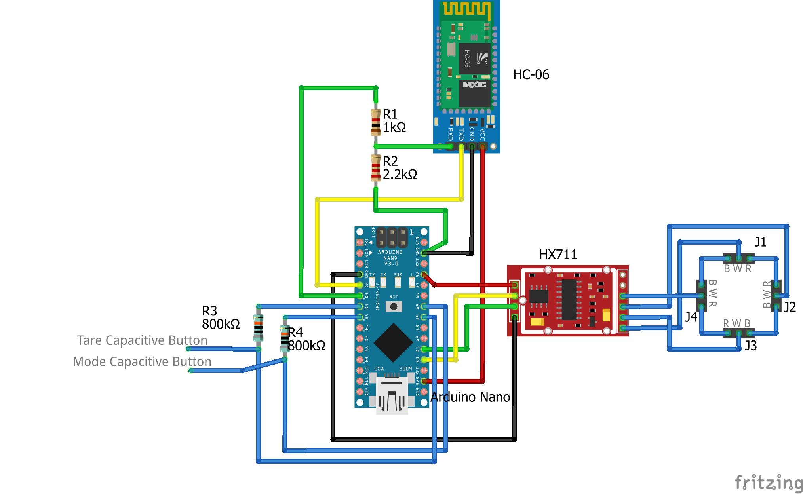

# btScaleDuino
A bluetooth (HC-06) enabled digital scale, whose load cell is used to read the current weight (hx711).

# Hardware modules
HX711: https://cdn.sparkfun.com/datasheets/Sensors/ForceFlex/hx711_english.pdf

HC-06 (HC-05 might also work with some modifications): https://www.olimex.com/Products/Components/RF/BLUETOOTH-SERIAL-HC-06/resources/hc06.pdf

# Android libraries used in this project
http://playground.arduino.cc/Code/Filters
https://github.com/bogde/HX711

# Associated software
## Android application
### How to edit the android code? 
Use the *.aia file as described in this documentation http://appinventor.mit.edu/explore/ai2/share.html
